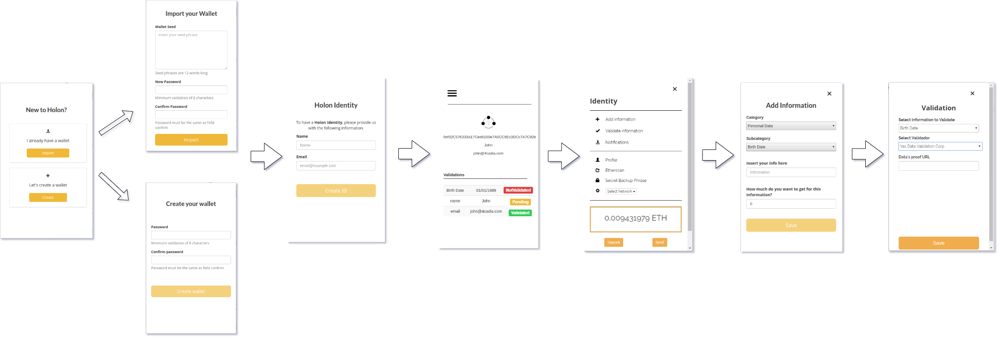

<p align="center">
  
</p>

<p>
<strong>Holon</strong> is a project to manage your identity in a decentralized way. The protocol was create to save user's data in Blockchain and give the power to the <i>user to control they own data</i>. This is a open source project, so this extension is a example of protocol>  aplication.
The base of this extension are smart contracts, created to save and manage the user's data and relationship between users, validators and consumers.
</p>



### User Story

As a Persona
- I can access the Holon dApp, create a new wallet or importing an existing wallet
- I can identify me as holon persona
So that	I can use the Holon dapp to manage my personal information
- I can add more informations in my identity
- I can send my informations for validatons

### Behavior

This screen is not displayed if the user has logged in before:
- **Screen: New to Holon!**
This screen user can choose create wallet or importing an existing wallet.
- **Screen: Import your wallet**
This screen user fill  a valid password and have a Mnemonic created
- **Screen: Create your wallet**
This screen user fill  a valid password and have a Mnemonic created
- **Screen: Holon Identity**
This screen user fill  a valid wallet seed
- **Screen: Home**
This screen have all your personal information and your status.
- **Screen: Add Information**
This screen can choose a category information, subcategory information, can put a value you want to get when share this information.
- **Screen: Validation**
This screen can choose information to validate and the validator you want to hire
- **Screen: Home**
This screen show all personal information and the status of validations.

- **Menu Identity**

 Option | Description |
 ------ |------|
Add Information |can add more personal information|
Validate Information|can hire a validator to validate information|
Notifications | recive notifications about consumers data|
Profile | all personal information and status |
Etherscan |link to Etherscan |
Secret Backup phrase| backup secret phrase|
Select Network|choose network for transactions |
Box Balance | show your wallet balance |
Buttons | Deposit and Send |


## Pre Requirements

- It is necessary install [Node](https://nodejs.org/en/) and [Npm](https://www.npmjs.com/).

## How to Install

To install in developer mode, follow the step-by-step:
1. Download the repository on your computer. 
2. Access the directory where you downloaded this project and run the command below.
```sh
  $ npm install
```

## How to Run

Run the command below for generate package **"dist"** on your project.
```sh
 $ npm run compile
```

## Add a extension in Chrome

To install the extension project in your Google Chrome:
- Access the browser and navigate to extensions 
  - Options -> More tools -> Extensions
- Enable "Developer Mode"
- Click in "Load Unpacked"
- Access the package **dist** builded previously in the project
  - holon-persona-plugin -> dist
- The Chrome browser will create your plugin in developer mode and make the icon available in the browser.

## Tech
To build this application was used:

 Technologies | Version |
 ------ |------|
  React | 16.8.6 |
  Bootstrap | 3.3.7 |
  Babel | 7.4.5 |
